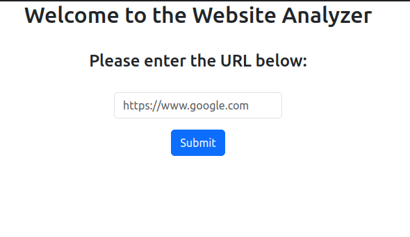

# website-analyzer-react-client
This is the web client app for the website-analyzer (https://github.com/Jagath01234/website-analyzer) Golang project. This is a simple and basic form created using react.

A frontend client supporting the APIs of this service can be found in the  https://github.com/Jagath01234/website-analyzer-react-client repository.
## Table of Contents

- [Requirements](#requirements)
- [Configuration](#configuration)
- [Installation](#installation)
- [Usage](#usage)
- [License](#license)

## Requirements
- Node version 20
- npm version 10

## Configuration
- Set the backend base url using the `backendUrl` constant in the `src/components/App.tsx` file. Default is set to `http://localhost:8080`

## Installation
- Navigate to project root directory using terminal.
- Run using `npm run dev`

## Usage
- Add the target website URl in the given text box and press submit button. https://github.com/Jagath01234/website-analyzer project should be running to serve the request in the backend.
- Result will appear after some time with the basic analysis details for the given target URL.
- 

## License
- This project is licensed under the GNU Lesser General Public License v3.0 (LGPL-3.0).
